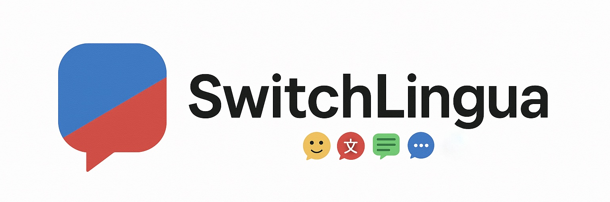

<div align="center">
  <a href="">
    
  </a>
</div>

<p align="center">
  <em>Embracing Multilingualism</em>
</p>

<div align="center">
  <a href="https://github.com/Shelton1013/SwitchLingua/issues">
    
  </a>
  <a href="https://github.com/Bauhinia-AI/Biosphere3/network">
    
  </a>
  <a href="https://github.com/Shelton1013/SwitchLingua/stargazers">
    
  </a>
  <a href="https://huggingface.co/datasets/Shelton1013/SwitchLingua">
    
  </a>
</div>

<!-- # 🚀 Embracing Multilingualism: Optimizing LLM Agents for Code-Switching Data Synthesis via Linguistic Principles and Tool Integration -->
# 🚀 SwitchLingua: The First Large-Scale Multilingual and Multi-Ethnic Code-Switching Dataset
> **Short Motto**: "Empowering Multilingual Research with High-Quality Code-Switching Datasets!" 🗣️🌍

Welcome to **SwitchLingua**, an open-source project aimed at providing high-quality **code-switching** (multilingual mixed) data for **NLP** and **linguistic** research. Our dataset is generated using advanced linguistic constraints, state-of-the-art Large Language Models (LLMs), and sociocultural insights — ensuring **naturalness, fluency, and diversity** in every sentence.

> *✨  Explore the nuances of bilingual speech in real-world contexts — from everyday chit-chat to formal news commentary!*

---

## 📖 Table of Contents
1. [Overview](#overview)
2. [Features](#features)
3. [Data Format](#data-format)
4. [Usage & Examples](#usage--examples)
5. [Quick Start](#quick-start)
6. [Project Structure](#project-structure)
7. [Contributing](#contributing)
8. [License](#license)
9. [Acknowledgments](#acknowledgments)

---

## 🧐 Overview
Code-switching (CS) is a fascinating phenomenon where speakers switch between languages or dialects in a single conversation or utterance. Our **CS Dataset**:

- Contains **bilingual/multilingual** mixed sentences covering various language pairs (e.g., English–Chinese, English–Spanish, Hindi–English, etc.).
- Reflects real-life communication patterns, including casual, formal, and domain-specific contexts (news, social media, interviews).
- Adheres to **linguistic constraints** such as the Equivalence Constraint, Functional Head Constraint, and more — ensuring grammatical coherence and natural usage.

This repository includes:
- **Data**: Pre-generated code-switching samples in JSON format.
- **Scripts/Tools**: Example scripts to generate or validate new code-switching data.
- **Documentation**: Best practices and guidelines for incorporating code-switching data in NLP tasks.

---

## ✨ Features
- **High-Quality Sentences**: Carefully curated and validated for **fluency** and **naturalness**.
- **Sociolinguistic Insights**: Includes expressions reflecting identity, cultural references, and context appropriateness.
- **Flexible Generation**: Tools to generate new code-switching data based on your specified languages, ratios, or domains.
- **Compatible with Major NLP Frameworks**: The dataset is easy to integrate with PyTorch, TensorFlow, Hugging Face, etc.

---

## 📁 Data Format
#### JSON
The generated data of this project is in the format of JSON. A simplified example of a single-turn entry might look like this:

```json
{
  "topic": "sports",
  "tense": "Present",
  "perspective": "Third Person",
  "cs_ratio": "30%",
  "gender": "Female",
  "age": "56-65",
  "education_level": "High School",
  "first_language": "Arabic",
  "second_language": "English",
  "conversation_type": "single_turn",
  "cs_function": "Expressive",
  "cs_type": "Intersentential",
  "data_generation_result": [
    "الفريق بدأ المباراة بشكل قوي جدًا وحقق تقدم كبير في البداية. But then the defense couldn't keep up and things started to fall apart.",
    "الجمهور كان متحمس جدًا في الربع الأول. The mood shifted quickly after halftime when the game got tense.",
    "الخسارة كانت صعبة على الجميع، خصوصًا بعد الأداء القوي في البداية. It's frustrating to see them lose after such a promising start."
  ],
  "fluency_result": {
    "fluency_score": 9,
    "errors": [],
    "summary": "The code-switched text demonstrates high fluency. All switches occur at clause or sentence boundaries, respecting both the Free Morpheme and Equivalence Constraints. There are no grammatical errors or unnatural mixing of word orders. The transitions between Arabic and English are smooth and natural, making the overall text coherent and easy to follow."
  },
  "naturalness_result": {
    "naturalness_score": 8.5,
    "observations": {
      "sentence_1": "The switch from Arabic to English occurs at a sentence boundary, which is common and natural for bilingual speakers. Both parts are idiomatic in their respective languages.",
      "sentence_2": "Again, the switch is at a sentence boundary. The English sentence is a natural follow-up to the Arabic one, and the mood shift is expressed idiomatically.",
      "sentence_3": "The switch is at a sentence boundary. Both the Arabic and English parts are natural and express frustration in a way that bilingual speakers often do."
    },
    "summary": "The code-switching in these sentences is highly natural, primarily using inter-sentential switching, which is common among bilingual speakers. The transitions between Arabic and English are smooth and occur at logical points, such as after a complete thought or sentence. The content in both languages is idiomatic and authentic, reflecting real-life bilingual speech patterns. There are no awkward or forced switches, and the emotional tone is consistent across both languages. Overall, this is a strong example of natural code-switching."
  },
  "cs_ratio_result": {
    "ratio_score": 7,
    "computed_ratio": "63% Arabic : 37% English",
    "notes": "The code-switched text contains approximately 63% Arabic words and 37% English words. The desired embedded language ratio is 30%, so the actual English usage is slightly higher than target, but still reasonably close. The code-switching is fairly balanced, with a slight overuse of English compared to the desired ratio."
  },
  "social_cultural_result": {
    "socio_cultural_score": 9,
    "issues": "No major socio-cultural issues detected. The code-switching between Arabic and English is natural and reflects common usage in sports discussions among bilingual speakers. The expressions used in both languages are appropriate and do not contain offensive or culturally insensitive terms. The only minor point is that the English segments could be slightly more localized to reflect regional sports jargon, but this is not a significant issue.",
    "summary": "The code-switched text is culturally appropriate and uses natural expressions in both Arabic and English. No significant issues found."
  },
  "summary": "\n    data_generation_result: [\"الفريق بدأ المباراة بشكل قوي جدًا وحقق تقدم كبير في البداية. But then the defense couldn't keep up and things started to fall apart.\", 'الجمهور كان متحمس جدًا في الربع الأول. The mood shifted quickly after halftime when the game got tense.', \"الخسارة كانت صعبة على الجميع، خصوصًا بعد الأداء القوي في البداية. It's frustrating to see them lose after such a promising start.\"]\n    Fluency Result: {'fluency_score': 9, 'errors': [], 'summary': 'The code-switched text demonstrates high fluency. All switches occur at clause or sentence boundaries, respecting both the Free Morpheme and Equivalence Constraints. There are no grammatical errors or unnatural mixing of word orders. The transitions between Arabic and English are smooth and natural, making the overall text coherent and easy to follow.'}\n    Naturalness Result: {'naturalness_score': 8.5, 'observations': {'sentence_1': 'The switch from Arabic to English occurs at a sentence boundary, which is common and natural for bilingual speakers. Both parts are idiomatic in their respective languages.', 'sentence_2': 'Again, the switch is at a sentence boundary. The English sentence is a natural follow-up to the Arabic one, and the mood shift is expressed idiomatically.', 'sentence_3': 'The switch is at a sentence boundary. Both the Arabic and English parts are natural and express frustration in a way that bilingual speakers often do.'}, 'summary': 'The code-switching in these sentences is highly natural, primarily using inter-sentential switching, which is common among bilingual speakers. The transitions between Arabic and English are smooth and occur at logical points, such as after a complete thought or sentence. The content in both languages is idiomatic and authentic, reflecting real-life bilingual speech patterns. There are no awkward or forced switches, and the emotional tone is consistent across both languages. Overall, this is a strong example of natural code-switching.'}\n    CSRatio Result: {'ratio_score': 7, 'computed_ratio': '63% Arabic : 37% English', 'notes': 'The code-switched text contains approximately 63% Arabic words and 37% English words. The desired embedded language ratio is 30%, so the actual English usage is slightly higher than target, but still reasonably close. The code-switching is fairly balanced, with a slight overuse of English compared to the desired ratio.'}\n    Social Cultural Result: {'socio_cultural_score': 9, 'issues': 'No major socio-cultural issues detected. The code-switching between Arabic and English is natural and reflects common usage in sports discussions among bilingual speakers. The expressions used in both languages are appropriate and do not contain offensive or culturally insensitive terms. The only minor point is that the English segments could be slightly more localized to reflect regional sports jargon, but this is not a significant issue.', 'summary': 'The code-switched text is culturally appropriate and uses natural expressions in both Arabic and English. No significant issues found.'}\n    ",
  "score": 8.475,
  "refine_count": 2
}
```


- **instances**: The actual code-switching utterances or conversation turns.
- **metadata**: Additional info such as language pair(s), CS type (intersentential, intrasentential, tag-switch), domain, ratio, etc.

#### CSV
The generated languages/texts in the format of reader-friendly .csv can be found [here](https://huggingface.co/datasets/Shelton1013/SwitchLingua).


#### Audio
Based on the generated text, we curate the audio dataset sourced from 174 speakers from 18 countries/regions and 63 racial backgrounds. The audio data (.m4a) can be found on [HuggingFace](https://huggingface.co/datasets/Shelton1013/SwitchLingua).


For more details, see [docs/DataFormat.md](docs/DataFormat.md).


## **🛠️ Usage & Examples**

### Setting up the environment

#### Create a dotenv file

```bash
API_KEY="YOUR_API_KEY_FOR_LLM"
API_BASE="BASE_URL"
```

#### Configure a config file

```bash
pre_execute:
  cs_ratio:
    - "70%"
    - "50%"
    - "30%"
  use_tools: true
  topics:
    - "business"
    - "entertainment"
    - "general"
    - "health"
    - "nation"
    - "science"
    - "sports"
    - "technology"
    - "world"
    
  tense:
    - "Past"
    - "Present"
    - "Future"
  perspective:
    - "First Person"
    - "Third Person"
  cs_function:
    - "Directive"
    - "Expressive"
    - "Referential"
    - "Phatic"
    - "Metalinguistic"
    - "Poetic"
  cs_type:
    - "Intrasentential"
    - "Intersentential"
    - "Extra-sentential / Tag switching"
  character_setting:
    nationality:
      first_language: "Arabic"
      second_language: "English"
    age:
      - "8-17"
      - "18-25"
      - "26-35"
      - "56-65"
      - "66+"
    gender:
      - "Male"
      - "Female"
    education_level:
      - "High School"
      - "College"
      - "Master"
      - "Doctor"
  conversation_type:
    - "single_turn"
    - "multi-turn"
  output_format:
    "json"
    
  

on_execute:
  round: 1
  verbose: true
```


### Generating New CS Sentences

1. **Set** your matrix_language (e.g., English) and embedded_language (e.g., Spanish) in config file.
2. **Specify** the code-switching ratio or style (intrasentential, intersentential, etc.).
3. **Run** the python script to produce a brand-new dataset using the integrated LLM prompt strategy.

```bash
python run_french.py
```

## **🏗️ Project Structure**


```
SwitchLingua/
├── core/
│   ├── agents.py     # main function
│   ├── node_engine.py # Agent Function
│   ├── node_model.py # Data schema
│   ├── prompt.py # prompts
│   └── mcp_tools.py
├── config /
│   └── xxxxxxxx.yaml                   # Generation Config
├── README.md
└── requirements.txt
```


- **core/**: Contains generation python scripts.
- **config/**: Detailed configuration for data generation


------


## **🤝 Contributing**


We 💖 contributions! Whether it’s:


- Submitting **bug reports** or **feature requests**,
- Creating **pull requests** for new language pairs,
- Or improving data quality with real-world usage examples!


Please read our [CONTRIBUTING.md](CONTRIBUTING.md) for guidelines on how to get started.


------


## **📝 License**


This project is licensed under the **MIT License** - see the [LICENSE](LICENSE) file for details.


------


## **🙌 Acknowledgments**


- Big thanks to the **multilingual NLP community** for their insights and open-source resources.
- Credit to our **contributors** and **volunteers** who helped refine the generation scripts.
- Shout-out to everyone using this dataset to push forward bilingual and code-switched NLP research! 🏆


------


*If you find this project useful or interesting, please ⭐ star this repo to show your support. Happy code-switching!* 🎉

```
```