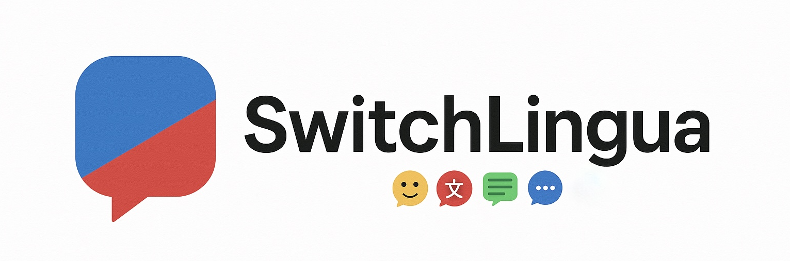

<div align="center">
  <a href="">
    
  </a>
</div>

<p align="center">
  <em>Embracing Multilingualism</em>
</p>

<div align="center">
  <a href="https://github.com/Shelton1013/SwitchLingua/issues">
    
  </a>
  <a href="https://github.com/Bauhinia-AI/Biosphere3/network">
    
  </a>
  <a href="https://github.com/Shelton1013/SwitchLingua/stargazers">
    
  </a>
</div>

# 🚀 Embracing Multilingualism: Optimizing LLM Agents
for Code-Switching Data Synthesis via Linguistic
Principles and Tool Integration

> **Short Motto**: "Empowering Multilingual Research with High-Quality Code-Switched Datasets!" 🗣️🌍

Welcome to **CS Dataset**, an open-source project aimed at providing high-quality **code-switched** (multilingual mixed) data for **NLP** and **linguistic** research. Our dataset is generated using advanced linguistic constraints, state-of-the-art Large Language Models (LLMs), and sociocultural insights — ensuring **naturalness, fluency, and diversity** in every sentence.

> *✨  Explore the nuances of bilingual speech in real-world contexts — from everyday chit-chat to formal news commentary!*

---

## 📖 Table of Contents
1. [Overview](#overview)
2. [Features](#features)
3. [Data Format](#data-format)
4. [Usage & Examples](#usage--examples)
5. [Quick Start](#quick-start)
6. [Project Structure](#project-structure)
7. [Contributing](#contributing)
8. [License](#license)
9. [Acknowledgments](#acknowledgments)

---

## 🧐 Overview
Code-switching (CS) is a fascinating phenomenon where speakers switch between languages or dialects in a single conversation or utterance. Our **CS Dataset**:

- Contains **bilingual/multilingual** mixed sentences covering various language pairs (e.g., English–Chinese, English–Spanish, Hindi–English, etc.).
- Reflects real-life communication patterns, including casual, formal, and domain-specific contexts (news, social media, interviews).
- Adheres to **linguistic constraints** such as the Equivalence Constraint, Functional Head Constraint, and more — ensuring grammatical coherence and natural usage.

This repository includes:
- **Data**: Pre-generated code-switched samples in JSON format.
- **Scripts/Tools**: Example scripts to generate or validate new code-switched data.
- **Documentation**: Best practices and guidelines for incorporating code-switched data in NLP tasks.

---

## ✨ Features
- **High-Quality Sentences**: Carefully curated and validated for **fluency** and **naturalness**.
- **Sociolinguistic Insights**: Includes expressions reflecting identity, cultural references, and context appropriateness.
- **Flexible Generation**: Tools to generate new code-switching data based on your specified languages, ratios, or domains.
- **Compatible with Major NLP Frameworks**: The dataset is easy to integrate with PyTorch, TensorFlow, Hugging Face, etc.

---

## 📁 Data Format
We primarily provide our data in **JSON**. A simplified example of a single-turn entry might look like this:

```json
{
  "instances": [
    "I really like ver películas los domingos."
  ],
  "metadata": {
    "languages": ["en", "es"],
    "cs_type": "intrasentential",
    "domain": "casual",
    "ratio": 0.3
  }
}
```


- **instances**: The actual code-switched utterances or conversation turns.
- **metadata**: Additional info such as language pair(s), CS type (intersentential, intrasentential, tag-switch), domain, ratio, etc.


For more details, see [docs/DataFormat.md](docs/DataFormat.md).


------


## **🛠️ Usage & Examples**


Here’s a quick snippet on how you might load and explore the dataset in Python:

```
import json

with open("data/code_switched_samples.json", "r", encoding="utf-8") as f:
    cs_data = json.load(f)

for sample in cs_data["instances"]:
    print("CS Sentence:", sample)
    # Perform your NLP tasks, e.g., tokenize, run a model, etc.
```


### **Generating New CS Sentences**


We also provide **script examples** (in scripts/generate_cs.py) for generating fresh code-switched sentences:


1. **Set** your matrix_language (e.g., English) and embedded_language (e.g., Spanish).
2. **Specify** the code-switching ratio or style (intrasentential, intersentential, etc.).
3. **Run** the script to produce a brand-new dataset using the integrated LLM prompt strategy.


```
python scripts/generate_cs.py \
  --matrix_language en \
  --embedded_language es \
  --cs_type intrasentential \
  --cs_ratio 0.3
```


------


## **⚡ Quick Start**


1. **Clone** the repo:


```
git clone https://github.com/YourGitHubUser/YourRepoName.git
cd YourRepoName
```


1. 
2. **Install** dependencies:


```
pip install -r requirements.txt
```


1. 
2. **Explore** the dataset:


```
python examples/explore_data.py
```


1. 
2. **Generate** new samples or test your code-switching pipeline.


------


## **🏗️ Project Structure**


```
YourRepoName/
├── data/
│   ├── code_switched_samples.json      # Example dataset
│   └── ...
├── docs/
│   └── DataFormat.md                   # Additional documentation
├── scripts/
│   ├── generate_cs.py                  # Script to generate new CS data
│   └── ...
├── examples/
│   └── explore_data.py                 # Simple usage demo
├── tests/
│   └── test_generation.py             # Basic unit tests
├── README.md
└── requirements.txt
```


- **data/**: Contains pre-generated CS data and sample sets.
- **docs/**: Detailed documentation on data format or usage.
- **scripts/**: Tools for data generation/validation.
- **examples/**: Minimal code examples to illustrate how to load or process the dataset.
- **tests/**: Unit tests (if any) to maintain data integrity and code quality.


------


## **🤝 Contributing**


We 💖 contributions! Whether it’s:


- Submitting **bug reports** or **feature requests**,
- Creating **pull requests** for new language pairs,
- Or improving data quality with real-world usage examples!


Please read our [CONTRIBUTING.md](CONTRIBUTING.md) for guidelines on how to get started.


------


## **📝 License**


This project is licensed under the **MIT License** - see the [LICENSE](LICENSE) file for details.


------


## **🙌 Acknowledgments**


- Big thanks to the **multilingual NLP community** for their insights and open-source resources.
- Credit to our **contributors** and **volunteers** who helped refine the generation scripts.
- Shout-out to everyone using this dataset to push forward bilingual and code-switched NLP research! 🏆


------


*If you find this project useful or interesting, please ⭐ star this repo to show your support. Happy code-switching!* 🎉

```
```